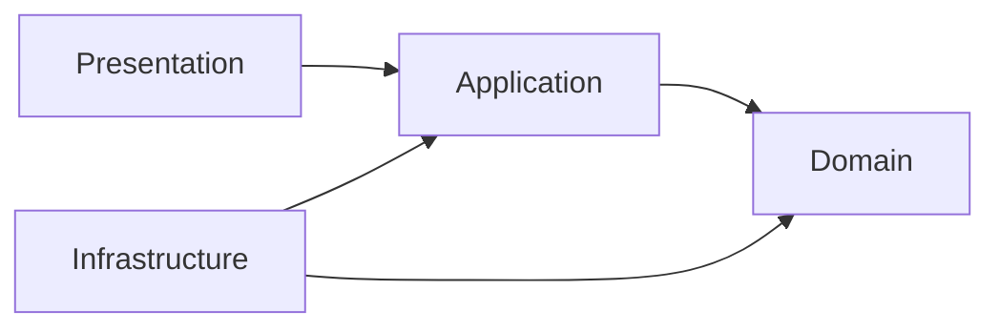

# Documentation / ADR Skill

## When to use this skill

Use this skill when the task involves repository documentation or architectural decision records.

Typical triggers:

- Create or update `README.md`.
- Create or update files under `docs/`.
- Create or review an ADR.
- Document architecture, API, auth, security, database, deployment, CI/CD, or environment decisions.
- Add or review Mermaid diagrams.
- Create or update `.github/copilot-instructions.md`.
- Review a PR that changes behavior, architecture, API contracts, env vars, database schema, security posture, deployment flow, or external integrations.
- Decide whether a change needs a new ADR.
- Keep AI coding agents aligned with the repository’s accepted standards.

## Goal

Keep repository documentation accurate, decision history traceable, and AI coding/review behavior consistent.

Documentation is not a separate afterthought. It is part of the implementation contract.

A code change is incomplete when the code changes architecture, API, security, deployment, database, environment, or externally visible behavior without updating the relevant docs.

## Core principles

- Docs live in the repository.
- `README.md` is the onboarding entry point.
- Detailed docs live under `docs/`.
- ADRs live under `docs/adr/`.
- Mermaid is the default diagram format.
- Diagram source text is the source of truth.
- `.github/copilot-instructions.md` is required for AI coding alignment.
- Accepted ADR history is never rewritten.
- New decisions supersede old decisions through new ADRs.
- Newest accepted ADR wins when standards conflict.
- Docs must be updated in the same PR as the code or config change they describe.
- AI-generated code is not trusted until reviewed, tested, and documented where needed.

## Required repository documentation structure

Use this baseline unless the repository has an accepted ADR that supersedes it.

```txt
README.md
.github/
  copilot-instructions.md
  pull_request_template.md
  CODEOWNERS
docs/
  product.md
  engineering-standards.md
  architecture.md
  api.md
  security.md
  database.md
  deployment.md
  openapi/
    openapi.yaml
  adr/
    ADR-0001-record-architecture-decisions.md
```

Not every project needs every optional document on day one, but the structure should be intentional.

Minimum baseline for a serious TypeScript project:

- `README.md`
- `.github/copilot-instructions.md`
- `docs/engineering-standards.md`
- `docs/architecture.md`
- `docs/adr/`

API projects should also include:

- `docs/api.md`
- `docs/openapi/openapi.yaml`

Security-sensitive projects should include:

- `docs/security.md`

Database-backed projects should include:

- `docs/database.md`

Deployable projects should include:

- `docs/deployment.md`

## README standard

`README.md` is for onboarding and operational entry points, not every detail.

A good README includes:

- Product or project purpose.
- Current status: PoC, Alpha, Beta, Production.
- Main tech stack.
- Runtime and package manager.
- Required environment variables reference.
- Local setup steps.
- Common commands.
- Test commands.
- Build commands.
- Deployment overview or link.
- Documentation map.
- ADR index link.

Keep README short enough that a new developer or coding agent can find the next document quickly.

Do not bury architecture policy only in README. Put durable engineering policy in `docs/engineering-standards.md` and decision history in ADRs.

## docs/product.md standard

Use `docs/product.md` to explain product context.

Include:

- Product goal.
- Non-goals.
- Target users.
- Core use cases.
- Domain terminology.
- Core entities.
- Business rules.
- State transitions.
- External systems.
- Risks and constraints.

This document helps AI coding agents avoid implementing technically correct but product-wrong behavior.

## docs/engineering-standards.md standard

Use this document for current coding and architecture standards.

Include:

- Runtime and package manager decisions.
- TypeScript baseline.
- Naming conventions.
- Import/export rules.
- Lint and formatting rules.
- API response conventions.
- Error handling conventions.
- Validation conventions.
- Logging and observability conventions.
- Security baseline.
- Testing baseline.
- Git and CI/CD baseline.

This document should represent the current standard, not the full decision history.

When standards change, update this document and add or supersede an ADR when the change is architecture-significant.

## docs/architecture.md standard

Use this document for the current system architecture.

Include:

- Architecture style.
- Module/component boundaries.
- Dependency direction.
- Folder structure.
- Key runtime flows.
- External integrations.
- Data flow.
- Error flow.
- Auth flow.
- Deployment topology when relevant.
- Boundary rules that coding agents must obey.

Architecture docs must reflect actual code structure. Do not document aspirational architecture as if it already exists.

## `.github/copilot-instructions.md` standard

This file is required.

It should tell AI coding agents:

- Product goal and non-goals.
- Important domain terminology.
- Core entities and business rules.
- Current architecture style.
- Folder structure.
- Dependency direction.
- Allowed and forbidden patterns.
- Testing expectations.
- Security expectations.
- Error handling expectations.
- API contract expectations.
- How to update docs and ADRs.

Keep it actionable. Avoid vague principles without operational rules.

## ADR purpose

ADRs record important decisions and the reasoning behind them.

ADRs are not generic documentation. They are immutable decision history.

Use ADRs to answer:

- What did we decide?
- Why did we decide it?
- What alternatives did we reject?
- What consequences did we accept?
- Which later ADR superseded this decision?

## When an ADR is required

Create an ADR for decisions that affect:

- Architecture style.
- Module boundaries.
- Dependency direction.
- API standard or public contract.
- Error envelope or status code policy.
- Auth or authorization model.
- Security baseline.
- Database choice.
- ORM or persistence pattern.
- Migration strategy.
- Deployment architecture.
- CI/CD strategy.
- Runtime or package manager.
- Major dependency adoption or replacement.
- Convention-changing decisions.
- Decisions that multiple future PRs must follow.

If a decision will be expensive to reverse or will guide future coding agents, create an ADR.

## When an ADR is not required

An ADR is usually not needed for:

- Small bug fixes.
- Local refactors that do not change boundaries or policy.
- Simple implementation details already covered by accepted standards.
- Temporary experiments that are not merged as durable direction.
- Updating examples without changing the decision.

If unsure, prefer a short ADR over losing decision context.

## ADR location and naming

ADRs live under:

```txt
docs/adr/
```

Use sequential numbering.

Recommended filename format:

```txt
ADR-0001-use-node-and-pnpm.md
ADR-0002-use-esm-only-typescript.md
ADR-0003-use-component-based-architecture.md
```

Rules:

- Never reuse an ADR number.
- Never renumber existing ADRs.
- Keep the title short and decision-oriented.
- Use kebab-case in filenames.
- Use four-digit numbers by default.

## ADR statuses

Allowed statuses:

- `Proposed`
- `Accepted`
- `Deprecated`
- `Superseded by ADR-0000`
- `Rejected`

Only `Accepted` ADRs define active policy.

`Proposed` ADRs are discussion artifacts.

`Rejected` ADRs explain why a path was not chosen.

`Deprecated` ADRs are no longer recommended but not necessarily replaced by one explicit ADR.

`Superseded by ADR-0000` means a newer ADR replaced the decision.

## ADR immutability rules

Do not rewrite accepted ADR history.

Allowed edits to accepted ADRs:

- Fix typos.
- Fix broken links.
- Add a “Superseded by ADR-0000” status.
- Add a short note pointing to a newer ADR.

Forbidden edits to accepted ADRs:

- Changing the original decision as if it had always been different.
- Removing rejected alternatives.
- Renumbering.
- Reframing consequences to hide trade-offs.

When the decision changes, create a new ADR.

## ADR template

Use the template in [references/adr-template.md](./references/adr-template.md).

Minimum required sections:

- Title.
- Status.
- Date.
- Context.
- Decision.
- Consequences.
- Alternatives considered.

Optional sections:

- Implementation plan.
- Migration notes.
- Security impact.
- Testing impact.
- Links to PRs, issues, or specs.

## ADR quality rules

A good ADR is:

- Decision-oriented.
- Specific.
- Honest about trade-offs.
- Short enough to read quickly.
- Clear enough for a future AI coding agent to follow.

Avoid:

- Writing a tutorial instead of a decision.
- Omitting alternatives.
- Hiding consequences.
- Using vague claims like “better architecture” without explaining forces.
- Combining many unrelated decisions into one ADR.

## Documentation update gates

Update docs in the same PR when a change affects:

- Public API behavior.
- OpenAPI contract.
- Error format.
- Status code behavior.
- Validation behavior.
- Auth or permission behavior.
- Tenant boundary behavior.
- Environment variables.
- Database schema.
- Migrations.
- Deployment process.
- CI/CD process.
- Security posture.
- External provider integration.
- Architecture boundaries.
- Folder structure.
- Developer setup.

If code and docs disagree, the PR is incomplete.

## Mermaid diagram standard

Use Mermaid for diagrams by default.

Use Mermaid for:

- Module dependency diagrams.
- Request flows.
- Auth flows.
- Deployment topology.
- State transitions.
- Sequence diagrams.
- Data flow diagrams.

Example:



Rules:

- Keep diagrams small and readable.
- Prefer multiple focused diagrams over one huge diagram.
- Commit diagram source as text.
- Do not rely only on screenshots or exported images.
- Update diagrams when architecture changes.

## AI coding workflow

When coding with this skill:

1. Identify whether the task changes behavior, architecture, API, env, database, security, deployment, or developer workflow.
2. Locate the relevant docs before editing code.
3. Check accepted ADRs for active decisions.
4. Apply the newest accepted ADR when there is conflict.
5. Update docs in the same change when required.
6. Create a new ADR when the decision is architecture-significant.
7. Keep README as navigation and onboarding, not a dumping ground.
8. Add or update Mermaid diagrams when flows or boundaries change.
9. Update `.github/copilot-instructions.md` when AI coding guidance changes.
10. Ensure CI can validate docs-related generated artifacts where applicable.

## AI review checklist

During review, verify:

- Does the PR change an architecture-significant decision?
- Is a new ADR required?
- Did the PR update existing docs when behavior changed?
- Does README still point to the right setup and docs?
- Do docs match actual code?
- Are ADR statuses correct?
- Are accepted ADRs preserved instead of rewritten?
- Does the newest accepted ADR win when standards conflict?
- Are Mermaid diagrams updated and stored as source text?
- Are env variables documented in `.env.example` and config docs?
- Are API changes reflected in OpenAPI docs?
- Are database changes reflected in migration/database docs?
- Are auth/security changes reflected in security docs?
- Are deployment or CI changes documented?
- Are AI coding instructions still accurate?

## Required documentation tests and checks

Use automated checks where practical:

- Markdown linting.
- Link checking.
- OpenAPI stale check for API projects.
- `.env.example` completeness checks when supported.
- ADR filename/status checks when supported.
- Mermaid render checks for important diagrams when supported.

Do not block all progress on perfect docs tooling, but do not accept stale or misleading docs.

## Common anti-patterns

Avoid:

- No README.
- README as the only documentation.
- Architecture decisions hidden only in chat history.
- Accepted ADRs rewritten instead of superseded.
- ADR numbers reused or renumbered.
- “Docs later” after architecture/API/security changes.
- Screenshots as the only diagram source.
- Diagrams not updated after architecture changes.
- `.github/copilot-instructions.md` missing or stale.
- AI agents coding without product/domain context.
- API changes without OpenAPI updates.
- Env changes without `.env.example` updates.
- Database changes without migration documentation.
- Security changes without security documentation.
- Vague ADRs with no alternatives or consequences.

## Final response expectations for agents

When this skill is used to implement or review a change, summarize:

- Which docs were checked.
- Which docs were updated.
- Whether an ADR was created or why it was not needed.
- Any documentation gaps that remain.
- Any conflicts between code and docs.
